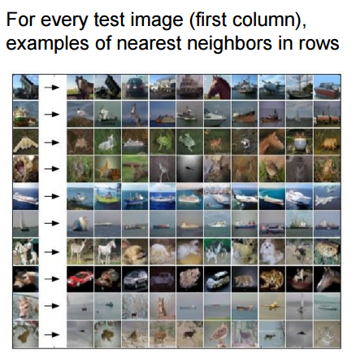

# Image Classification

### Image Classification Pipeline
* **Input**: N images labelled with one of the k different classes
* **Learning**: Our task is to use the training set to learn what every one of the classes looks like. We refer to this step as training a classifier, or learning a model.
* **Evaluation**: Predict labels for new set of images

```python
def train(train_images, train_labels):
    #build model for images -> labels
    return model

def predict(model, test_images):
    #predict test labels using the model
    return test_lables
```

### Nearest Neighbor classifier
* During training, just remember all the training images and their labels
* During prediction, output the label of the most similar training image



To find the most similar images in the training set, compare the images using L1 distance. That is since the images are just blocks of 32x32x3 pixels, compare them pixel by pixel and add up all the differences.

$ \sum_{\forall i}{x_i^{2}} $
